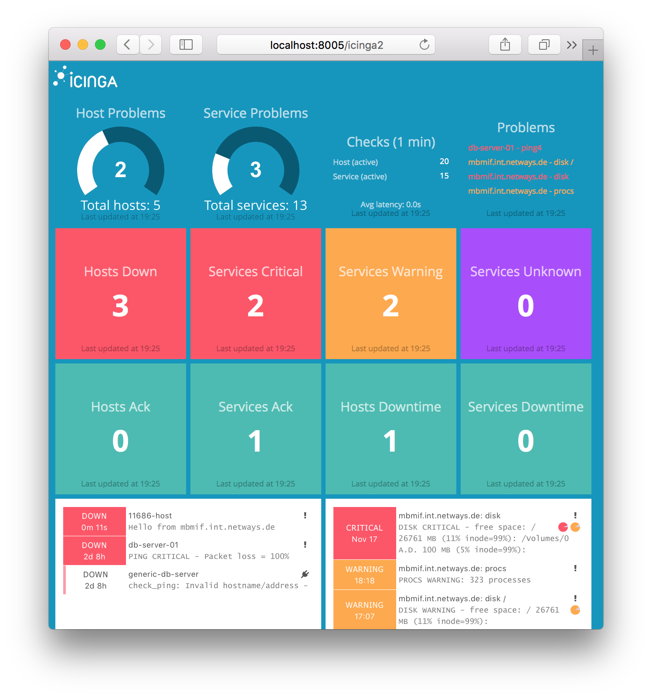

# General

[Dashing](http://shopify.github.io/dashing/) is a Sinatra based framework
that lets you build beautiful dashboards.

This dashing implementation uses the Icinga 2 API
to show basic alerts on your dashboard.

**This is intended for demo purposes and not for production usage.**
You may use the provided examples in your own implementation.

# License

* Dashing is licensed under the [MIT license](https://github.com/Shopify/dashing/blob/master/MIT-LICENSE).
* Icinga specific jobs and dashboards are licensed under the GPLv2+ license.

# Requirements

* Ruby, Gems and Bundler
* Dashing Gem
* Icinga 2 API (v2.4+)

Gems:

    gem install bundler
    gem install dashing

## Icinga 2

Icinga 2 provides either basic auth or client certificates for authentication.

Therefore add a new ApiUser object to your Icinga 2 configuration:

    vim /etc/icinga2/conf.d/api-users.conf

    object ApiUser "dashing" {
      password = "icinga"
      client_cn = "icinga2a"
      permissions = [ "*" ]
    }

In case you want to use client certificates, set the `client_cn` from your connecting
host and put the client certificate files (private and public key, ca.crt) in the `pki`
directory.

> **Note**
>
> The job script will attempt to use client certificates once found in the `pki/` directory
> instead of basic auth.

## Dashing Configuration

Edit `jobs/icinga2.erb` and adjust the settings for the Icinga 2 API credentials.

# Run

Install all required ruby gems:

    bundle install

On OSX El Capitan [OpenSSL was deprecated](https://github.com/eventmachine/eventmachine/issues/602),
therefore you'll need to fix the eventmachine gem:

    brew install openssl
    bundle config build.eventmachine --with-cppflags=-I/usr/local/opt/openssl/include
    bundle install --path binpaths

Now start dashing:

    ./run.sh

(or `dashing start`).

Navigate to [http://localhost:3030](http://localhost:3030)

# Thanks

[roidelapliue](https://github.com/roidelapluie/dashing-scripts) for the Icinga 1.x dashing script.

# TODO

* Fix config.ru settings
* Hints for Docker integration (docker-icinga2)

# Developer Hints

## Dashing Installation

    sudo gem install dashing
    sudo gem install bundler

    dashing new icinga2
    cd icinga2
    bundle

    dashing start

## Widgets

    dashing generate widget table
    dashing generate widget showmon

## Jobs

    dashing generate job icinga2

